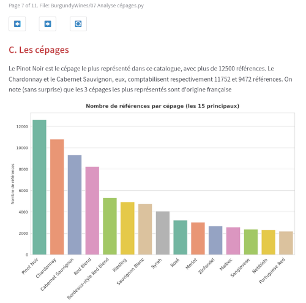

# Data analysis : a french Burgundy wines study

#### A demo multi-page Python / Streamlit web app, with the help of [Streamlit Book](https://pypi.org/project/streamlit-book/) library.

**Context** : a dummy wine seller wants my advice to set the prices for 14 new french Burgundy wine bottles, for the US market.

**Method** : I analysed a dataset of 130k+ bottles references, with their grape variety _(cépage)_, their vintage _(millésime)_, their price, on top of an enologist rating and review.
After a heavy duty cleaning, I first tried a Data Visualisation / Business Intelligence approach, then an AI one, with several Machine Learning models, in order to advise my client the most appropriate prices for their new bottles.

**Stack** : Python, Streamlit, Pandas, Scikit Learn, Matplotlib, Seaborn 

 
--

_Coded with ❤️ as a Wild Code School Data Science project._

_All images come from [Pixabay](https://pixabay.com)._
